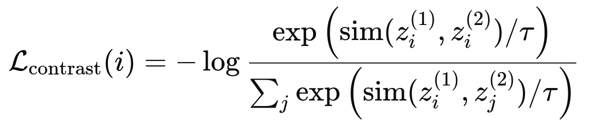

# Contrastive Learning Approach

This framework builds upon the **SUBLIME** GSL framework with custom datasets to perform tweet analysis focused on extremism and narrative features.

## Table of Contents

- [Overview](#overview)
- [Installation](#installation)
- [Datasets](#datasets)
- [Methodology](#methodology)
  - [Contrastive Loss](#contrastive-loss)
- [Usage](#usage)
  - [Quick Start](#quick-start)
  - [Running Experiments](#running-experiments)
  - [Adding Context-Based Edges](#adding-context-based-edges)
  - [Sensitivity Analysis with Sweeps](#sensitivity-analysis-with-sweeps)
- [Configuration Parameters](#configuration-parameters)
  - [Hardware & Reproducibility](#hardware--reproducibility)
  - [Contrastive Learning (GCL)](#contrastive-learning-gcl)
  - [Graph Learner & Adjacency](#graph-learner--adjacency)

---

## Overview

Framework for learning graph structures from data and performing downstream tasks like node classification. This implementation focuses on analyzing tweets for extremism detection using graph neural networks with contrastive learning.

---

## Installation

### 1. Download the code

### 2. Set Up Virtual Environment (recommended but optional)

```bash
python3 -m venv .venv
source .venv/bin/activate  # On Windows use `.venv\Scripts\activate`
```

### 3. Install Dependencies

```bash
pip install -r requirements.txt
```

> **Note:** The dgl (Deep Graph Library) install is for CPU, not GPU, so you may encounter errors.

---

## Datasets

Below are the main datasets used in this project, with both their description and the corresponding **class names** to use in the code (see `preprocessing.py`):

| Dataset | Description | Filename | Code Reference |
|---------|-------------|----------|----------------|
| **Toxigen** | English-language data for toxicity and stereotype analysis | `Toxigen.csv` | `ToxigenDataset` |
| **FRENK LGBTEn** | English-language dataset focusing on LGBT-related posts and annotations | `LGBTEn.csv` | `LGBTEnDataset` |
| **FRENK MigrantsEn** | English-language dataset focusing on migrant-related posts and annotations | `MigrantsEn.csv` | `MigrantsEnDataset` |
| **Multilingual EN Corpus German** | 1000 German tweets annotated for extremism and narrative features | `Multilingual_EN_Corpus_DATA_GERMAN.xlsx` | `MultilingualENCorpusGermanDataset` |
| **Multilingual EN Corpus French** | 1000 French tweets annotated for extremism and narrative features | `Multilingual_EN_Corpus_DATA_FRENCH.xlsx` | `MultilingualENCorpusFrenchDataset` |
| **Multilingual EN Corpus Cypriot** | 1000 Cypriot tweets annotated for extremism and narrative features | `Multilingual_EN_Corpus_DATA_CYPRIOT.xlsx` | `MultilingualENCorpusCypriotDataset` |
| **Multilingual EN Corpus Slovene** | 1000 Slovene tweets annotated for extremism and narrative features | `Multilingual_EN_Corpus_DATA_SLOVENE.xlsx` | `MultilingualENCorpusSloveneDataset` |

---

## Methodology

### Multi-View Contrastive Learning

<!-- **Purpose:**   -->
Contrastive learning is a representation learning framework where the objective is to maximize concordance among different representation pairs, which are instances originating from the same data sample. In the context of graph learning, two graph representations are compared at the node level (ground truth vs learned representation).

<!-- To ensure the representation (embedding) of the same node under two different graph views is very similar, while representations of different nodes are clearly distinct. -->

**Pipeline Overview:**
<!-- **How it works:** -->

1. **Embedding:** Input texts are mapped into a latent vector space.

2. **Graph Initialisation:** Two graph *Views* are created. The first *View*, referred to as the *Anchor View*, is created from the embedded data itself using the kNN algorithm. The second view, referred to as the *Learner View*, is produced via a Graph Structure Learning Module. 

3. **Data Augmentation:** Both graph views undergo a series of transformations (feature masking and edge dropping) to benefit the model through exploring richer underlying semantic information. 

4. **Node-level Contrastive Learning:** To maximise node-level mutual information between nodes, we apply contrastive learning. Both views are passed through a GNN-based encoder to extract node-level representations, which are then mapped to another latent space where the contrastive loss is calculated and projected at the node level using the following equation:



Where $\text{sim}(\cdot, \cdot)$ is cosine similarity and $\tau$ is the temperature parameter.

5. **Structure Bootstrapping:** Using a constant anchor graph may lead to the Inheritance of error information and Lack of persistent guidance. Structure Bootstrapping is used once every 𝑐 iterations to update the Anchor View with learned representations from the Learner View.


**Contribution:**
We build upon this framework (originally presented by **liu2022unsuperviseddeepgraphstructure**) by introducing context edges during the graph initialisation (step 2). Nodes sharing the same context attributes (e.g., *In-Group*, *Out-group*) are used to build a **context-based anchor adjacency matrix** that **guides** the learning of feature-based graph structures via contrastive learning.


<!-- 1. **For each node**, we create two "views" (versions with small random changes)
2. **We measure similarity** between the same node under different views using cosine similarity (1 = identical, -1 = opposite)
3. **We maximize** this similarity for the same node
4. **We minimize** the similarity for different nodes -->


---

## Usage

### Quick Start

1. **Update Configuration**  
   Edit `experiment_params.csv` to set your experiment parameters.

2. **Run an Experiment**  
   ```bash
   python src/main.py -exp_nb 1
   ```
   Replace `1` with the desired experiment number.

3. **Output**  
   After running, you should have:
   - Text embeddings in `embeddings/`
   - Resulting matrices in `adjacency_matrices/`
   - Loss plot in `plots/`

### Running Experiments

Below are the main experiments with updated dataset mapping and descriptions:

| Exp # | Dataset | Configuration | Command |
|-------|---------|---------------|---------|
| 1 | Toxigen (English) | `exp_nb=1`, `epoch=4000` | `python src/main.py -exp_nb 1` |
| 2 | FRENK LGBTEn | `exp_nb=2`, `epoch=4000` | `python src/main.py -exp_nb 2` |
| 3 | FRENK MigrantsEn | `exp_nb=3`, `epoch=4000` | `python src/main.py -exp_nb 3` |
| 4 | Multilingual EN Corpus German | `exp_nb=4`, `epoch=4000` | `python src/main.py -exp_nb 4` |
| 5 | Multilingual EN Corpus French | `exp_nb=5`, `epoch=4000` | `python src/main.py -exp_nb 5` |
| 6 | Multilingual EN Corpus Cypriot | `exp_nb=6`, `epoch=4000` | `python src/main.py -exp_nb 6` |
| 7 | Multilingual EN Corpus Slovene | `exp_nb=7`, `epoch=4000` | `python src/main.py -exp_nb 7` |

> **Note:** Adjust `epoch` or other arguments as needed for your experiments in `experiment_params.csv`.


<!-- ### Adding Context-Based Edges

This framework supports **context-guided graph structure learning**, extending the SUBLIME paradigm.
Context attributes (e.g., *In-Group*, *Out-group*) are used to build a **context-based anchor adjacency matrix**
that **guides** the learning of feature-based graph structures via contrastive learning. -->

<!-- #### How It Works

Graph structure learning operates on **two graph views**:

- **Anchor View (Context Graph)**  
  A fixed adjacency matrix constructed from shared values in the specified context columns.
  Nodes sharing the same attribute value are connected.
  This graph is **not learned**.

- **Learner View (Feature Graph)**  
  A learnable adjacency matrix inferred from node features (text embeddings and optional attributes),
  using cosine similarity.

A contrastive loss aligns node representations produced by these two views, encouraging the learned
feature-based structure to be consistent with contextual relationships.

After training, a **k-nearest neighbor (kNN)** graph is constructed from the learned embeddings and saved for downstream tasks. -->

#### To Add Context Guidance

- Use `--use_context_adj` to activate the context-based adjacency as the anchor view during contrastive training
- Use `--add_attr_edges` to construct the context-based anchor graph
- Specify context columns using `--context_columns`
- Limit context edges per node using `--attr_edges_max`

#### Example Command

```bash


python src/main.py -exp_nb 4 --gpu 0 \
  --use_context_adj \
  --add_attr_edges \
  --context_columns "In-Group" "Out-group" \
  --attr_edges_max 10 \
  --epochs 4000 \
  --lr 0.005 --w_decay 1e-4 \
  --nlayers 2 --hidden_dim 256 \
  --rep_dim 256 --proj_dim 128 \
  --dropout 0.5 --dropedge_rate 0.2
```


### Sensitivity Analysis with Sweeps

To explore the impact of different parameters on graph construction and model performance, you can perform a **sensitivity analysis sweep**. The sweep allows you to vary:

- **`k` (text-based edges):** Controls the number of neighbors connected using embeddings
- **`attr_edges_max` (context-based edges):** Limits the maximum number of context-driven edges per node

#### Example Command

```bash
python src/main.py -exp_nb 4 --gpu 0 --run_sweep \
  --sweep_k_list 5,10,15,25 \
  --sweep_max_list 0,10,50 \
  --context_columns "In-Group" "Out-group" \
  ----use_context_adj \
  --add_attr_edges \
  --sweep_epochs 400 \
  --epochs 400 --maskfeat_rate_anchor 0.35 --maskfeat_rate_learner 0.35 \
  --temperature 0.08 --lr 0.005 --w_decay 1e-4 \
  --nlayers 2 --hidden_dim 256 --rep_dim 256 --proj_dim 128
```


## Configuration Parameters

### Hardware & Reproducibility

- `--gpu` int (default: `0`): GPU index to use. If no GPU is available, the run will fall back to CPU
- `--ntrials` int: Number of repeated experiments for reproducibility across multiple runs

### Contrastive Learning (GCL)

- `--temperature` float: Temperature parameter for contrastive loss
- `--maskfeat_rate_anchor` float: Feature masking rate for the anchor view
- `--maskfeat_rate_learner` float: Feature masking rate for the learner view
- `--nlayers` int: Number of GCL encoder layers
- `--hidden_dim` int: Hidden dimension size in the encoder
- `--rep_dim` int: Final representation (embedding) dimension
- `--proj_dim` int: Projector head dimension after the encoder
- `--dropout` float: Dropout rate inside the encoder/projector
- `--dropedge_rate` float: Edge dropout rate for graph augmentation

### Graph Learner & Adjacency

- `--sparse` bool: Use sparse adjacency operations
- `--type_learner` str: Graph learner type. Options: `fgp`, `mlp`, `att`, `gnn`
- `--k` int: Number of neighbors for k-NN when building adjacency
- `--sim_function` str: Similarity function. Options: `cosine`, `dot`
- `--activation_learner` str: Activation used in the graph learner (e.g., `relu`)
- `--gsl_mode` str: Graph structure mode. Options: `structure_refinement`, `structure_inference`
- `--n_neighbors` int: Number of neighbors to keep in the final adjacency
- `--sym` bool: Symmetrize the adjacency matrix


---
